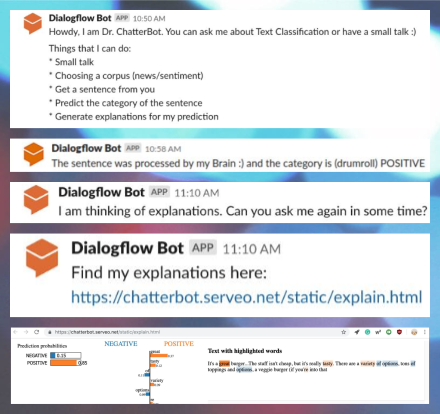

## Welcome to our amazing project :)
#### This is a Dialogflow chat bot which helps classify text and generate explanations, with Pytorch and Flask backend.

 
 

<b> Requirements </b>
> Flask==1.0.3  
> gensim==3.7.3 
> nltk==3.4.1 
> lime==0.1.1.34 
> torch==1.1.0 
> torchvision==0.3.0 
> pandas==0.23.4 
> If we missed anything, please find and install it :P 

 

<b> To experiment with the ML models </b>
> <i> sh <b>google.sh</b>   </i>
>> Downloads the GoogleNews-vectors-negative300.bin.gz file which we use for the word embeddings.

> <i> python <b>train.py</b> -m <model type : nn|lr> -cname <sentiment|news>   </i>
>> Trains the specified model (neural net or logistic regression) on specified dataset (sentiment or news corpus) and saves the models, checkpoints and data in the pkl_files directory.

> <i> python <b>eval.py</b> -m <model type : nn|lr> -cname <sentiment|news> -option <kfold|test>   </i>
>> For option kfold, evaluates the specified model based on stratified 5 fold technique and outputs the mean and standard deviation of the accuracies obtained.  

> <i> python <b>predict.py</b> -m <model type : nn|lr> -cname <sentiment|news> -ipath <input path>   </i>
>> Runs news or text classification on the sentences in the file saved at input path and saves the predictions to the output path.

> <i> python <b>explain.py</b> -m <model type : nn|lr> -cname <sentiment|news> -ipath <input path> </i>
>> Generates LIME explanations for a sentence stored in the file at input path based on the model type and corpus name specified.   This returns a very descriptive html output!

 

<b> To run the ChatterBot on Slack using DialogFlow </b>

> <i> sh <b>serveo.sh</b> </i>
>> Runs the ssh url serve in a loop. Equivalent to ngrok but with a contant URL! 😲

> <i> python <b>server.py</b> </i>
>> Runs the flask server which exposes the Pytorch models to the world through Serveo. Dialogflow interacts with this server to give an awesome ChatterBot on slack!

> <i> ChatterBot.zip </i>
>> For more details about DialogFlow, please check : https://dialogflow.com/docs/getting-started.   We have also included our DialogFlow .zip model for you to enjoy.

Okay bye :)
